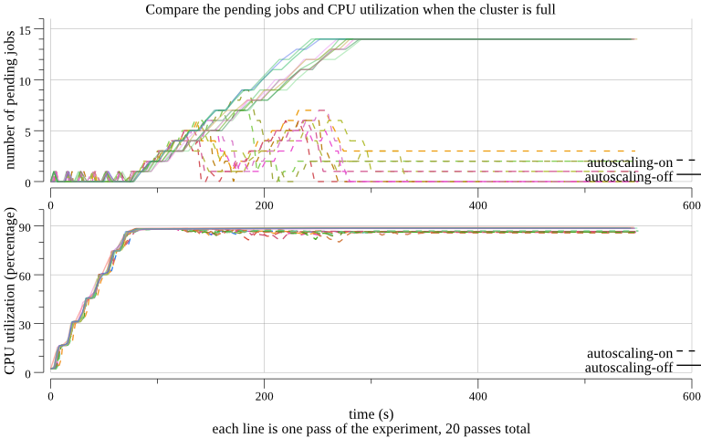
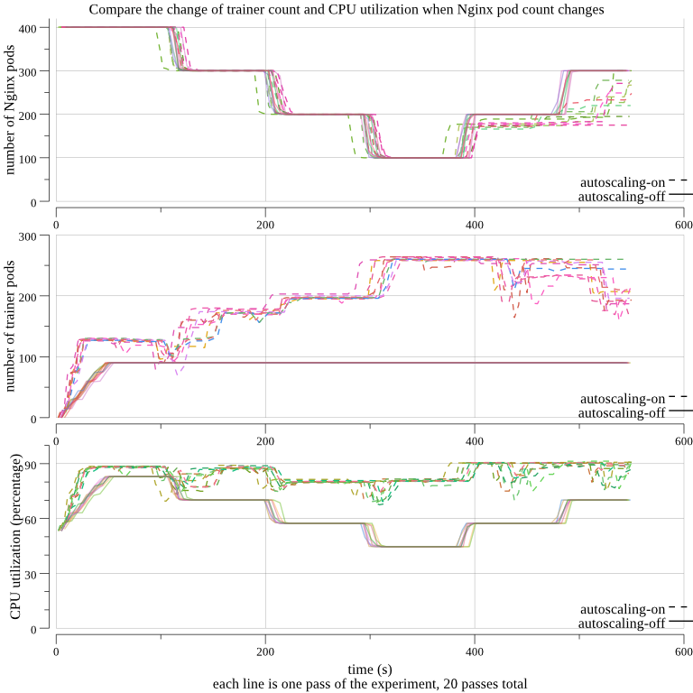

# Auto-scaling Experiment

## Purpose

To verify the value of PaddlePaddle's auto-scaling mechanism.

## Metrics

1. Cluster computing resource utilization.
    - Expecting higher resource utilization.
    - Higher utilization means less resource is idle. Autoscaling
      intended to maximize the overall cluster resource(CPU, GPU,
      memory) usage by ensuring resource for production level
      jobs/services, then fairly scale jobs that are scalable to use
      the resource left in the cluster.
    - In this experiment, we are focusing on CPU's utilization.
1. Training Job average pending time.
    - Expecting less pending time.
    - Long pending time is a common pain point for researchers with the internal
      cluster.
    - The less pending time the earlier developers and researchers can
      start seeing the training cost curve, and the better they can
      verify the training algorithm effectiveness.
    - In this experiment, we will verify if auto-scaler will kill existing
PaddlePaddle training process to make room for newly submitted jobs.
1. Quality of service of the online services.
    - When PaddlePaddle jobs are deployed along with online services, check if 
PaddlePaddle training job will yield resources to more important online services
 when the load is getting intensive.

## Our setup

- The Kubernetes cluster with v1.6.2 installed, with 133 physical
  nodes.
- PaddleCloud with the latest develop branch installed.
- A medium sized neural networks model is used in the experiment.

## Test Cases

### Autoscaling on the Special Purpose Cluster

All the job in the cluster will be training jobs (hence the name
special purpose cluster). This case is a very typical scenario for
research institutes.

#### Variable

- Autoscaling ON/OFF.

#### Invariant

- The number of jobs.
- The configurations of each job are the same, except:
  1. each autoscaling job asks for 2 - 60 trainers, and
  1. each non-autoscaling job asks for 60 trainers.
- The submission time of each job.


#### Experiment Steps


1. With autoscaling turned on, submit the training jobs with 10
   seconds delay between each job, 20 jobs in total. Repeat the experiment for 10 passes.
1. With autoscaling turned off, submit the training jobs with 10
   seconds delay between each job, 20 jobs in total. Repeat the experiment for 10 passes.


#### Experiment Result

##### Graphs



In the above graph, the solid line is for non-autoscaling experiment
passes, the dashed line is for autoscaling experiment passes. 

We can see that the pending job counts for the autoscaling jobs are
significantly lower than the non-autoscaling jobs while still remain the CPU utilization high.

Non-autoscaling's pending job count is climbing after 100s of the experiment and stick at 14 till the end. That means the cluster's resource is exhausted when 6 jobs are running, newly submitted jobs have to wait. Meanwhile in autoscaling experiment, even when resources are exhausted, newly submitted job can still start, because autoscaler scaled existing job down to make room for it.

The reason you see ridges in the graph is: jobs are not deployed in one shot,
there is a 10s delay between jobs' submission, it will take some time for the job to be actually created. The time in non-autoscaling experiment is simply Kubernetes job launching time; While the time in autoscaling experiment case is auto-scaler killing other PaddlePaddle pods and Kubernetes job launching time.

Also above graph, we can see after the utilization stabilizes, the
cluster utilization of autoscaling jobs are slightly lower than the
non-autoscaling jobs. We think this is due to:

1. the computation resources wasted when the autoscaler is trying to
free up resources for the new incoming jobs.

1. autoscaling and non-autoscaling jobs have different distributions
   of the numbers of trainer, pserver, master pods. The computation
   resources for each node are fragmented differently, leading to the
   utilization around 88% for non-autoscaling jobs vs around 86% for
   autoscaling jobs when stabilized.

##### Metrics

- Autoscaling ON

	PASS|AVG PENDING TIME|CLUSTER CPU UTILS
	---|---|---
	0|24|	75.5646
	1|59|	75.9876
	2|31|	75.0465
	3|63|	76.0976
	4|32|	76.6245
	5|85|	76.1902
	6|67|	76.3599
	7|45|	77.8456
	8|38|	76.8869
	9|28|	76.7175
	AVG|42.9091|	76.3321


- Autoscaling OFF

	PASS|AVG PENDING TIME|CLUSTER CPU UTILS
	---|---|---
	0|319|	76.2028
	1|305|	75.8829
	2|295|	79.8287
	3|309|	75.0948
	4|315|	75.5644
	5|319|	75.2832
	6|298|	75.3558
	7|311|	75.578
	8|316|	76.9651
	9|298|	75.8706
	AVG|280.455|	76.1626

### Autoscaling on the General Purpose Cluster

Hybrid deployment with online serving and offline training Job (hence
the name general purpose cluster). We will deploy PaddlePaddle
training job and [Nginx](https://www.nginx.com/resources/wiki/) web
serving together. This case is a very typical scenario for large
enterprises and internet companies.

#### Variable

- The number of Nginx instances, changing over time, simulating the
  real world traffic load distribution over time.
- Autoscaling ON/OFF.

#### Invariant

- The number of training jobs.
- The configurations of each training job are the same, except:
  1. each autoscaling job asks for 2 - 60 trainers, and
  1. each non-autoscaling job asks for 60 trainers.
- The submission time for each training job.
- The configuration of each Nginx job.

#### Experiment Steps

1. With autoscaling turned on, start 400 Nginx instances to simulate
   the number of Nginx instances required for the peak time load.

1. Start the training jobs.

1. Decrease the Nginx instance count of 400 to 100 over time, to
   simulate the Nginx load decreases, requiring fewer Nginx instances.

1. Increase the Nginx instances count of 100 to 400 over time, to
   simulate the full Nginx load cycle.

1. Repeat the experiment for 10 passes.

1. Repeat the above steps with autoscaling turned off.

#### Experiment Result

##### Graphs



The solid line is for non-autoscaling experiment passes, the dashed line is for
autoscaling experiment passes.

The above graph shows the number of Nginx instances changing over
time, simulating a typical online cluster usage. Meanwhile when auto-scaling is enabled, the PaddlePaddle job trainer pods count is changing along in a opposite trend.

Also when autoscaling is turned on, the cluster
utilization is kept high even though the online Nginx service is
scaled down.


##### Metrics

- Autoscaling ON

	PASS|AVG PENDING TIME|CLUSTER CPU UTILS
	--- | --- | ---
	0|33|83.7926
	1|38|83.0557
	2|29|82.8201
	3|22|84.3083
	4|62|82.8449
	5|21|83.2045
	6|70|83.0649
	7|69|83.8079
	8|101|83.5989
	9|70|83.7494
	AVG|53.55|83.4247

	Off-peak (300s - 370s) average cluster utilization:
	79.3505

- Autoscaling OFF

	PASS|AVG PENDING TIME|CLUSTER CPU UTILS
	--- | --- | ---
	0|1|62.3651
	1|0|61.7813
	2|1|61.6985
	3|0|61.4403
	4|2|61.8323
	5|3|61.7459
	6|2|61.5679
	7|2|62.1981
	8|3|61.9676
	9|1|62.0316
	AVG|1.5|61.8629

	Off-peak (300s - 370s) average cluster utilization:
	44.9134

You might have noticed the hike of average pending time. The reason
behind this is the mechanism of gradually deployment of tasks to
minimize the impact to online services.

##### Data Log

Every number and plot in the report is calculated from the raw
data. You can find the calculation programs and the raw
data
[here](https://github.com/PaddlePaddle/cloud/tree/develop/doc/autoscale/experiment/result)

## Conclusions

### Resource utilization

As shown in Case 2 in a general purpose cluster, the CPU utilization
increased by 34.8% (`(83.4247-61.8629)/61.8629`) on average; During
the off-peak time, the CPU utilization even surged by 76.7%
(`(79.3505-44.9134)/44.9134`).

Clearly, now your PaddlePaddle machine learning jobs is running in the computing resource reservoir prepared for the rainy day. When the situation is getting
tough, machine learning tasks will size itself down without fault and
give resources back automatically.

### Average Pending time

As shown in case 1 in a special purpose cluster, the average pending
time reduced by 84.7% (`(280.455-42.9091)/280.455`) on average.

### Improved the service quality with general purpose cluster

As shown in test case 2, PaddlePaddle yields resource to more
important online services when the load is getting intensive.

## Reproducing the Experiment

### Preparation

1. Configure kubectl and paddlectl on your host.
1. Submit the TrainingJob controller with the YAML file.

```bash
> git clone https://github.com/PaddlePaddle/cloud.git && cd cloud
> kubectl create -f k8s/controller/trainingjob_resource.yaml
> kubectl create -f k8s/controller/controller.yaml
```

### Run the Test Case

Run the TestCase1 or TestCase2 for serval passes with the bash script
`./run.sh`:

For example, run TestCase1 for 10 passes and 10 jobs:
```bash
> cd cloud/doc/autoscale/experiment
> TAG=round_1 AUTO_SCALING=OFF PASSES=1 JOB_COUNT=20 ./run.sh start case1
```

Or submit an auto-scaling training job

```bash
> cd cloud/doc/autoscale/experiment
> TAG=round_1 AUTO_SCALING=ON PASSES=1 JOB_COUNT=20 ./run.sh start case1
```

Or run the TestCase2 with 5 jobs:
```bash
> TAG=round_1 AUTO_SCALING=ON JOB_COUNT=6 ./run.sh start case2
```
		
Note: the the test output will be written to different folders (the
folder name is generated based on the test configuration), so it's ok
to run the tests in a loop to get multiple round of data:

```
> for i in `seq 1 2`; do echo pass $i; TAG=round_$i JOB_COUNT=6 ./run.sh start case2; done
pass 1
outputing output to folder: ./out/mnist-OFF-6-1-ON-400-case_case2-round_1
```


### Plot Data and Generate Report

Please see [here](./result/README.md)

#### Raw Data Format
	
The time series data will be appended to the file
`./out/*/mnist-case[1|2]-pass[0-9].log`, the content of `*` depends on
the test case config and will be printed in the beginning.
		
as the following format:

```
0,2.11,0,3,0,0,0,0,0|0|0,0.00|0.00|0.00
2,2.11,0,3,0,0,0,0,0|0|0,0.00|0.00|0.00
4,2.11,0,3,0,0,0,0,0|0|0,0.00|0.00|0.00
5,2.11,0,2,1,0,0,0,0|0|0,0.00|0.00|0.00
7,5.30,7,2,0,1,0,0,7|0|0,3.19|0.00|0.00
9,7.90,19,2,0,1,0,0,19|0|0,5.79|0.00|0.00
10,8.11,20,2,0,1,0,0,20|0|0,6.01|0.00|0.00
```

The meaning of each column is:

timestamp|total cpu util|# of running trainer|# of not exist jobs|# of pending jobs|# of running jobs|# of done jobs|# of Nginx pods|running trainers for each job |cpu utils for each job
--|--|--|--|--|--|--|--|--|--
