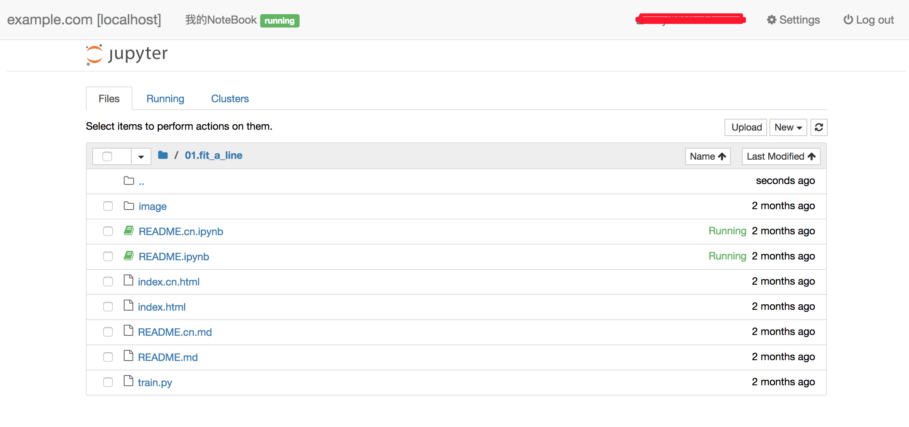

# Web Interface design

This design doc will talk about features and web pages needed to let users to manage cloud paddle jobs.

## Feature List

- Account Management
    - Registration, send email to inform if registration suceeded
    - Account Login/Logout
    - Password changing, find back
    - Download SSL keys
- Jupiter Notebook
    - Private Jupiter Notebook environment to run Python scripts
    - Private workspace
    - Submit job from Jupiter Notebook
- Job Dashboard
    - Job history and current running jobs
    - Performance Monitoring
    - Quota Monitoring
- Datasets
    - Public Dataset viewing
    - Upload/Download private datasets
    - Share datasets
- Models
    - Upload/Download models file
    - Share/Publish Models
- Paddle Board
    - Training metrics visualization
        - cost
        - evaluator
        - user-defined metrics
- Serving
    - Submit serving instances
    - Deactivate serving
    - Serving performance monitoring

## Account Management

I'll skip this section because it is a design that almost every website need.

## Jupiter Notebook

Start a ReplicaSet using image `docker.paddlepaddle.org/book` in kubernetes cluster and add an ingress endpoint when user first enters the notebook page.



Users can write program in python in the web page and save their programs, which will be saved at cloud storage. Users also can run script like below to submit a cluster training job:

```python
sess = paddle.framework.remote_session(
    topology=block,
    reader=reader,
    jobname="cluster_job",
    gpu=12
)
sess.run()
```

After this, there will be a job description and perfomance monitoring pages able to view at "Job Dashboard"

## Job Dashboard

### Job history and current running jobs

A web page containing a table to list jobs satisfing user's filters. User can only list jobs that was submited by themselves.

| jobname | start time | age      | success | fails | actions |
| ------- | ---------- | -------- | ------- | ----- | ------- |
| test1   | 2017-01-01 | 17m      |    0    |   0   | stop/log/perf |

Users can filter the list using:

- status:  running/stoped/failed
- time:    job start time
- jobname: search by jobname

Viewing job logs:

Click the "log" button on the right of the job will pop up a console frame at the bottom of the page showing the tail of the job log, here shows the first pod's log. On the left side of pop up console frame, there should be a vertical list containing the list of pods, when click one of the pod, the console will show the log of it.

### Performance Monitoring

A web page containing graphs monitoring job's resource usages according to time change:

- CPU usage
- GPU usage
- memory usage
- network bandwidth
- disk I/O

### Quota Monitoring

A web page displaying total quota and quota currently in use.

Also display total CPU time, GPU time in latest 1day, 1week and 1month.

## Datasets and Models

Datasets and Models are quite the same, both like a simple file management and sharing service.

- file listing and viewing page
- Upload/Download page
- file sharing page

## Paddle Board

A web page containing graphs showing the internal status when job is training, metrics like:

- cost, can be multiple cost graphs
- evaluator output
- user-defined metric

User can caculate metrics and define the graph like:

```python
cost = my_train_network()
evaluator = my_evaluator(output, label)
def my_metric_graph(output, label):
    metric = paddle.auc(output, label)
my_metric = my_metric_graph(output, label)
my_metric_value = output

draw_board(cost, evaluator)
draw_board(my_metric)
draw_board(my_metric_value)
```

Calling `draw_board` will output graph files on the distributed storage, and then the web page can load the data and refresh the graph.

## Serving

After training or uploading pre-trained models, user can start a serving instance to serve the model as an inference HTTP service:

The page which user can start the serving should be able to configure:
1. model `tar.gz` file path in cloud.
1. inference network configuration in `.proto` format, or user can also define the network in Python in the webpage.
1. number of CPU/GPU resource in total to use for serving the model, the more resource there is, the more concurrent calls can be served.

After cliking the "Langch" button, a "kubernetes deployment" will be created to serve the model. The current serving instances will be listed at the current page.

Users can also scale/shrink the resource used for the serving instances.