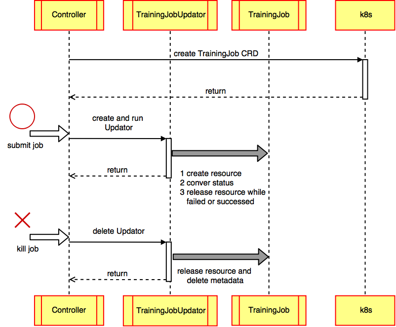
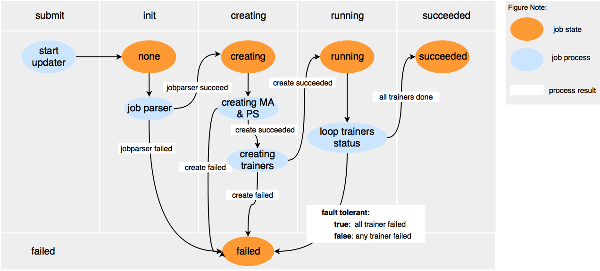

# Design Doc: Elastic Deep Learning

## Background

A PaddlePaddle training job contains several trainer instances,
several parameter server instances, and one master instance. 
We are going to define PaddlePaddle cluster job using Kubernetes [CRD](https://kubernetes.io/docs/concepts/api-extension/custom-resources/). 
Each job is described using a yaml representation called TrainingJob. 
With CRD, we can manage the PaddlePaddle cluster job as easy as k8s primary resources. 
We also would like to automatically scale the number of training instances and the
number of parameter server instances to fully utilize the cluster's
computation resources. We call this Elastic Deep Learning.

Currently, we have two controller Lifecycle Controller and Autoscale Controller to support the functions mentioned 
above. We will merge them in the near future.

**The goals of Lifecycle Controller including:**

- Implement a controller and register a TrainingJob CRD
- Create and delete TrainingJob
- TrainingJob life cycle management

**The goals of Autoscale Controller including:**

- Autoscale trainer and pserver

Currently, we will only support trainer autoscaling. Parameter server
autoscaling will be supported in the near future. This design doc
considers both of them. [Horizontal Pod Autoscaling (HPA)](https://kubernetes.io/docs/tasks/run-application/horizontal-pod-autoscale/) is
an autoscaling solution provided by Kubernetes, but it's not suitable
for the training job autoscaling for the following reasons:

- The goal of autoscaling is to fairly distribute the computation
  resources to different training jobs in a way that optimizes the
  computation resource utilization of the **entire** cluster. The HPA
  is trying to improve the quality of service of a **single**
  service. The training job autoscaling requires the controller to
  have a global view of all the available computation resources and
  all the training jobs, but HPA does not have the global view.

- HPA is designed to automatically scale a homogeneous set of Pods,
  but we need to scale a heterogeneous set of Pods (the trainer Pods
  and the parameter server Pods): because the required number of
  parameter servers is correlated to the required number of trainers,
  we need to scale them together.

So we need to develop our own Autoscale Controller.

## Requirements

K8s 1.8+  and [Golang 1.9+](https://golang.org/dl/) are required for this project.

## Design

### Concepts
#### Training Job Resource

Just
like
[Deployment](https://kubernetes.io/docs/concepts/workloads/controllers/deployment/) is
a resource that describes a deployment. We will have a training
job
[Custom Resource](https://kubernetes.io/docs/concepts/api-extension/custom-resources/) that
describes the training job.

A pseudo resource declaration (`training_job.yaml`) is as follows:

```yaml
apiVersion: paddlepaddle.org/v1alpha1
kind: TrainingJob
metadata:
  name: paddlejob
  namespace: testspace
spec:
  image: "paddlepaddle/paddlecloud-job"
  port: 7164
  ports_num: 1
  ports_num_for_sparse: 1
  fault_tolerant: false
  mountPath: "/home/work/namespace/"
  master:
    resources:
      limits:
        cpu: "800m"
        memory: "1Gi"
      requests:
        cpu: "500m"
        memory: "600Mi"
  pserver:
    min-instance: 2
    max-instance: 2
    resources:
      limits:
        cpu: "800m"
        memory: "1Gi"
      requests:
        cpu: "500m"
        memory: "600Mi"
  trainer:
    entrypoint: "python train.py"
    workspace: "/home/job-1/"
    passes: 10
    min-instance: 2
    max-instance: 6
    resources:
      limits:
        cpu: "200m"
        memory: "200Mi"
      requests:
        cpu: "200m"
        memory: "200Mi"
```

The lifecycle controller will create a PaddlePaddle cluster job with a master, 2 pserver, 2 trainer and update state 
of the training job.

The autoscale controller will create and continuously scale the
number of trainers and the number of pservers between the
corresponding `min-instance` and `max-instance`.

Since the `master` server is required only when the trainer is using
`paddle.v2.reader.creator.cloud_reader`, The `master` spec is
optional: the master server will be created only when configured.

The training job custom resource can be created with: `kubectl create
-f training_job.yaml`.

#### TrainingJobUpdater

In lifecycle controller, we need an object which named TrainingJobUpdater to manages a specific TrainingJob. 
Including job spec, current status and events of this job. 
Here is the struct of TrainingJobUpdater.
 
 ```go
 type trainingJobEventType string
 
 const (
 	trainingJobEventDelete trainingJobEventType = "Delete"
 	trainingJobEventModify trainingJobEventType = "Modify"
 )
 
 type trainingJobEvent struct {
 	// pet is the TrainingJobEventType of TrainingJob
 	pet trainingJobEventType
 	// The job transfer the information fo job
 	job *v1alpha1.TrainingJob
 }
 
 // TrainingJobUpdater is to manager a specific TrainingJob
 type TrainingJobUpdater struct {
 	// job is the job the TrainingJobUpdater manager.
 	job *v1alpha1.TrainingJob
 
 	// kubeCli is standard kubernetes client.
 	kubeCli kubernetes.Interface
 
 	// trainingJobClient is the client of TrainingJob.
 	trainingJobClient trainingJobClient.Interface
 
 	// status is the status in memory, update when TrainingJob status changed and update the CRD resource status.
 	status v1alpha1.TrainingJobStatus
 
 	// eventCh is the channel received by Controller, include Modify and Delete.
 	// When trainingJobEvent is Delete it will delete all resources
 	// The maximum is 1000.
 	eventCh chan *trainingJobEvent
 }
 
 ```
 
 When user submit a TrainingJob, lifecycle controller start a TrainingJobUpdater to manage the TrainingJob. 
 - It will parser the config to TrainingJob spec including PSERVER, MASTER and TRAINER.
 - It will create resource orderly. 
 - It will sync the status of the job at regular time. While the status changed, it will update the job's status to k8s. 
 - It will release all the resource while the job succeeded or failed.
 
#### Controller

**Lifecycle Controller**

The lifecycle controller manages distributed PaddlePaddle jobs by creating a series of TrainingJobUpdaters. Here is the struct of 
Controller.
```go
type Controller struct {
	// KubeCli is a standard kubernetes clientset
	KubeCli kubernetes.Interface
	// ApiCli is the extension kubernetes clientset
	ApiCli apiextensionsclient.Interface
	// PaddleCli is a clientset for our own API group
	PaddleCli paddleclientset.Interface

	trainingjobLister paddlelisters.TrainingJobLister
	trainingjobSynced cache.InformerSynced

	jobtracker map[string]*updater.TrainingJobUpdater

	// workqueue is a rate limited work queue. This is used to queue work to be
	// processed instead of performing it as soon as a change happens.
	workqueue workqueue.RateLimitingInterface
	// recorder is an event recorder for recording Event resources to the
	// Kubernetes API.
	recorder record.EventRecorder
}

```

- It start to confirm that there are only one TrainingJob controller in cluster.
- It will register TrainingJob CRD to cluster if there is no TrainingJob resource.
- It will create a TrainingJobUpdater while PaddlePaddle job was submitted and delete the TrainingJobUpdater while job was 
deleted.

**Autoscale Controller**

The autoscale controller runs as a Pod. It has the global view of
the computation resources. It watches the training job resources and
schedules and scales the training jobs using the Kuberenetes API.

The pseudo controller declaration (`autoscale_controller.yaml`) is
as follows:

```yaml
apiVersion: extensions/v1beta1
kind: Deployment
metadata:
  name: autoscale-controller
spec:
  replicas: 1
  template:
    metadata:
      labels:
        name: autoscale-controller
    spec:
      containers:
      - name: autoscale-controller
        image: paddlepaddle/training-job-controller
```

The training job controller can be started by the cluster
administrator with command: `kubectl create -f autoscale_controller.yaml`

You can use `go/cmd/autoscaler/Dockerfile` to build a new controller image 
or downloading an existing one.

## Implementation

### Lifecycle Controller
#### Lifecycle Overall

The whole life cycle of TrainingJob is managed through the two layer control of Lifecycle Controller and TrainingJobUpdater. As 
shown in the following figure:


As shown above, when the job is submitted, `Controller` will create a `TrainingJobUpdater` by `NewUpdater` and start 
the lifecycle manager. `TrainingJobUpdater` will start `InitResource` with a goroutine and start a `Ticker` to sync the
state of the trainingjob. When the state is changed to `failed` or `succeeded`, resources of PSERVER and MASTER will 
be released.

When the job is killed, resources of PSERVER and MASTER will be released and the metadata will be deleted.


#### State Machine

The struct of TrainingJob Status as follows.

```go
type TrainingJobStatus struct {
	// Phase is phase of TrainingJob
	Phase TrainingJobPhase `json:"phase"`
	// Reason is the reason of job phase failed
	Reason string `json:"reason"`
	// ScaleStatus is autoscale status of trainer jobs
	ScaleStatus TrainerJobScaleStatus `json:"scale_status"`
	// ReplicaStatuses is detail status of resources
	ReplicaStatuses []*TrainingResourceStatus `json:"replica_statuses"`
}
```

We define five phases to describe the traingingjob:

- TrainingJobPhaseNone: `""`
- TrainingJobPhaseCreating: `creating`
- TrainingJobPhaseRunning: `running`
- TrainingJobPhaseSucceeded: `succeeded`
- TrainingJobPhaseFailed: `failed`

When a job was submitted to cluster. Controller will start a Updater to manager the lifecycle. Here is the state 
machine of a TrainingJob:


As shown above, when the job is submitted, controller will start a Updater and the state of the job is none. While 
the job config is valid and through parser, the state will convert to `creating`. While all the resources are set up,
 the state will convert to `running`. While all trainer are succeeded or any trainer succeeded (fault tolerant mode),
  the state will convert to `succeeded`. Otherwise, the state will convert to `failed`.


### Autoscale Controller

Currently, we will run a single training job controller instance and
assume that there is no training job controller running concurrently
(the assumption could be false
when
[split-brain](https://en.wikipedia.org/wiki/Split-brain_(computing))
happens). In the future, we will run multiple instances and use leader
election to choose a leader.

The pseudo-logic is as follows:

```go
registerThirdPartyResource()
for {
  quota := getTotalComputationResourceQuota()
  current := getCurrentJobStates()
  desired := getDesiredJobStates()
  dynamicScaling(quota, current, desired)
}
```

#### Scaling Algorithm

##### Elastic Job

A job is elastic only when it's trainer and pserver's `min-instance`
equals to the `max-instance` respectively. We will only scale elastic
jobs.

Currently, we will not scale the parameter server instances.

##### Fulfillment Score

When there are available computation resources, the algorithm needs to
decide which jobs to assign the resources to. When there are no more
available computation resources but the newly submitted job needs it,
the algorithm needs to decide which job to take the resource away
from. We will introduce the *fulfillment score* to answer these
questions:

```go
func (j Job) Score() float64 {
  minInstance := j.spec.trainer.minInstance
  maxInstance := j.spec.trainer.maxInstance
  curInstance := j.trainer.currentInstance()
  return float64(curInstance - minInstance) / float64(maxInstance - minInstance)
}
```

##### Scaling GPU Jobs

The controller knows the total number of available GPUs in a cluster
and will try to assign all of them to the training jobs.

All elastic GPU jobs will be sorted according to their fulfillment
score. The number of GPU per instance, CPU requests value, Mem
requests value will be used as tiebreakers in decreasing importance.

An available GPU resource will be assigned to the least fulfilled job
unless that job is already fulfilled (with a fulfillment score of
`1.0`). A GPU resource will be taken away from the most fulfilled job
when there is another GPU job's `min-instance` is not satisfied
(unless the most fulfilled job's `cur-instance` equals to
`min-instance`). When the most fulfilled job's `cur-instance` equals
to `min-instance`, no training job will be scaled down, the new job
cannot be scheduled and will wait for more resources.


##### Scaling CPU Jobs

The controller knows the total CPU capacity, Mem capacity of the
cluster, and the total CPU limits, Mem limits of all training jobs. We
define the available CPU and Mem as the difference of the capacity and
the
[limits](https://kubernetes.io/docs/concepts/policy/resource-quotas/#requests-vs-limits) (not
the
[requests](https://kubernetes.io/docs/concepts/policy/resource-quotas/#requests-vs-limits))
respectively.

All elastic CPU jobs will be sorted according to their fulfillment
score. The CPU requests value, Mem requests value will be used as
tiebreakers in decreasing importance.

The available CPU and Mem resource will be assigned to the least
fulfilled job unless that job is already fulfilled (with a fulfillment
score of `1.0`). The CPU and Mem resource will be taken away from the
most fulfilled job when there is another job's `min-instance` is not
satisfied (unless the most fulfilled job's `cur-instance` equals to
`min-instance`). When the most fulfilled job's `cur-instance` equals
to `min-instance`, no training job will be scaled down, but the job
will still be scheduled optimistically.

## References

- [Writing a custom controller: Extending the functionality of your cluster](https://resources.coreos.com/youtube-coreos-fest-2017/writing-a-custom-controller-extending-the-functionality-of-your-cluster)
- [Introducing Operators: Putting Operational Knowledge into Software](https://coreos.com/blog/introducing-operators.html)
- [TPR Is Dead! Kubernetes 1.7 Turns to CRD](https://coreos.com/blog/custom-resource-kubernetes-v17)
- [Writing Controllers](https://github.com/kubernetes/community/blob/master/contributors/devel/controllers.md)
