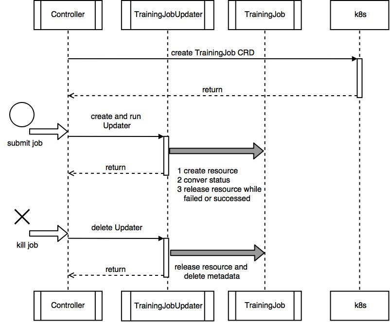
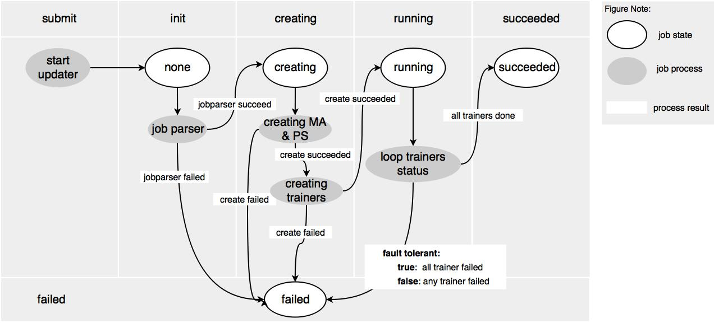

# Design Doc: Elastic Deep Learning

## Background

A PaddlePaddle training job contains several trainer instances,
several parameter server instances, and one master instance. 
We would like to manage the lifecycle (create, delete and update) of each PaddlePaddle training job in the cluster and atomically scale them to fully utilize the cluster's
computation resources. We call this Elastic Deep Learning (or EDL for short).

[Horizontal Pod Autoscaling (HPA)](https://kubernetes.io/docs/tasks/run-application/horizontal-pod-autoscale/) is
an autoscaling solution provided by Kubernetes, but it's not suitable
for the training job autoscaling for the following reasons:

- HPA dosn't manage heterogeneous set of Pods lifecycle and status
  change, we need a controller for this.
- The goal of autoscaling is to fairly distribute the computation
  resources to different training jobs in a way that optimizes the
  computation resource utilization of the **entire** cluster. The HPA		
  is trying to improve the quality of service of a **single**		
  service. The training job autoscaling requires the controller to		
  have a global view of all the available computation resources and		
  all the training jobs, but HPA does not have the global view.		
- HPA is designed to automatically scale a homogeneous set of Pods,		
  but we need to scale a heterogeneous set of Pods (the trainer Pods		
  and the parameter server Pods): because the required number of		
  parameter servers is correlated to the required number of trainers,		
  we need to scale them together.		

We need to develop our own solution for autoscaling.

Kubrenetes provide [CustomResourceDefinition (CRD)](https://kubernetes.io/docs/concepts/api-extension/custom-resources/#custom-resources)and [custom controller](https://kubernetes.io/docs/concepts/api-extension/custom-resources/#custom-controllers)
we can use these feature to develop EDL controller, so it can flexiblly running in our
cluster and does not require modifying the Kubernetes source code.

## Solution

1. Defination of PaddlePaddle `TrainingJob` using CRD, it should contain:
    1. One `ReplicaSet` of a single master process
    1. One `ReplicaSet` of several parameter server process
    1. One `Job` of several trainer process
1. A controller that manages the `TrainingJob`'s:
    1. Creation, deletion and update
    1. Keep `TrainingJob` status synchronized with it's components
    1. Periodically scale job resources in cluster

### TrainingJob CRD

Just like
[Deployment](https://kubernetes.io/docs/concepts/workloads/controllers/deployment/) is
a resource that describes a deployment. We will have a training
job
[Custom Resource](https://kubernetes.io/docs/concepts/api-extension/custom-resources/) that
describes the training job.

A pseudo resource declaration (`training_job.yaml`) is as follows:

```yaml
apiVersion: paddlepaddle.org/v1
kind: TrainingJob
metadata:
  name: paddlejob
  namespace: testspace
spec:
  image: "paddlepaddle/paddlecloud-job"
  port: 7164
  ports_num: 1
  ports_num_for_sparse: 1
  fault_tolerant: false
  mountPath: "/home/work/namespace/"
  master:
    resources:
      limits:
        cpu: "800m"
        memory: "1Gi"
      requests:
        cpu: "500m"
        memory: "600Mi"
  pserver:
    resources:
      limits:
        cpu: "800m"
        memory: "1Gi"
      requests:
        cpu: "500m"
        memory: "600Mi"
  trainer:
    entrypoint: "python train.py"
    workspace: "/home/job-1/"
    passes: 10
    min-instance: 2
    max-instance: 6
    resources:
      limits:
        cpu: "200m"
        memory: "200Mi"
      requests:
        cpu: "200m"
        memory: "200Mi"
```

In the above example, EDL will create a PaddlePaddle cluster job with one master,
2 pservers, 2 trainers, and keep the status synchronized. Then the controller will
try to scale up/down `TraningJobs` in cluster if needed to maximize the cluster
utility. You can create the `TrainingJob` using `kubectl create -f training_job.yaml`.
 
Currently, we will only support trainer autoscaling. Parameter server autoscaling
will be supported in the near future. This design doc considers both of them.

NOTE: You can omit the master spec if you want to start a non-scalable job.

### TrainingJobUpdater

To keep the `TrainingJob` status synchronized with actual Kubernetes `ReplicaSet`s
and `Job`s, We need an object named `TrainingJobUpdater` to manage each
`TrainingJob`. 

Each `TrainingJobUpdater` need to be informed by events generated by Kubernetes
`ReplicaSet`, `Job` and `Pod`. For example, when the `TrainingJob` is scaling up,
some of the Pods may in status `Restarting`, so we should update the `TrainingJob`
status to "Scaling up".
 
```go
type trainingJobEventType string

const (
trainingJobEventDelete trainingJobEventType = "Delete"
trainingJobEventModify trainingJobEventType = "Modify"
)

type trainingJobEvent struct {
// pet is the TrainingJobEventType of TrainingJob
pet trainingJobEventType
// The job transfer the information fo job
job *v1.TrainingJob
}

// TrainingJobUpdater is to manager a specific TrainingJob
type TrainingJobUpdater struct {
// job is the job the TrainingJobUpdater manager.
job *v1.TrainingJob
// kubeCli is standard kubernetes client.
kubeCli kubernetes.Interface
// trainingJobClient is the client of TrainingJob.
trainingJobClient trainingJobClient.Interface
// status is the status in memory, update when TrainingJob status changed and update the CRD resource status.
status v1.TrainingJobStatus
// eventCh is the channel received by Controller, include Modify and Delete.
// When trainingJobEvent is Delete it will delete all resources
// The maximum is 1000.
eventCh chan *trainingJobEvent
}
```
 
When user submit a TrainingJob, the controller will start a TrainingJobUpdater to manage the TrainingJob. 
 - Parse `TrainingJob` to corresponding pserver, master `ReplicaSet`
   and trainer `Job`.
 - Create pserver, master and trainer.
 - Keep the status synchronized.
 - Stop master and pserver processes when job is finished or failed.
 
### Controller

The controller manages PaddlePaddle `TrainingJob`s by creating a series of 
`TrainingJobUpdater` instances. The controller defination follows:

```go
type Controller struct {
  KubeCli kubernetes.Interface
  ApiCli apiextensionsclient.Interface
  PaddleCli paddleclientset.Interface
  trainingjobLister paddlelisters.TrainingJobLister
  trainingjobSynced cache.InformerSynced
  jobtracker map[string]*updater.TrainingJobUpdater

  workqueue workqueue.RateLimitingInterface
  recorder record.EventRecorder
}
```

- Register `TrainingJob` CRD if it's not registered yet.
- Create a `TrainingJobUpdater` instance for each `TrainingJob`.

The controller will runs as a Pod. It has the global view of
the computation resources. It watches the training job resources and
schedules and scales the training jobs using the Kuberenetes API.

The pseudo controller declaration (`autoscale_controller.yaml`) is
as follows:

```yaml
apiVersion: extensions/v1beta1
kind: Deployment
metadata:
  name: autoscale-controller
spec:
  replicas: 1
  template:
    metadata:
      labels:
        name: autoscale-controller
    spec:
      containers:
      - name: autoscale-controller
        image: paddlepaddle/training-job-controller
```

The training job controller can be started by the cluster
administrator with command: `kubectl create -f autoscale_controller.yaml`

You can use `go/cmd/autoscaler/Dockerfile` to build a new controller image 
or download an existing one.

Currently, `Autoscaler` is not a k8s controller actually, we will merge it to controller in a near feature.

## Implementation

### TrainingJob CRD

The training job resource is a custom resource. There are two ways of implementing custom resources:

- [Custom Resource Definition (CRD)](https://kubernetes.io/docs/tasks/access-kubernetes-api/extend-api-custom-resource-definitions/), since Kubernetes v1.7.
- [Third Party Resource (TPR)](https://kubernetes.io/docs/tasks/access-kubernetes-api/extend-api-third-party-resource/), since Kubernetes v1.2, fully deprecated in v1.8, will be removed in v1.9.

We will support TPR first, because some of our clusters is using Kubernetes v1.6.

In the near feature, we will use CRD to replace TPR to define our training job resource,
then the resource defined under `go/edl/resource` will be deprecated.
If you want to use TPR in Kubernetes with version <= 1.7,
please checkout the `unreleased-tpr` tag.

Currently, implementation using CRD is still under development,
you can use the following command to verify and generate dependent codes:
```
# check freshness of generated codes
$ scripts/verify-codegen.sh

# update dependent codes
$ scripts/update-codegen.sh
```
For more details, please refer to [article](https://blog.openshift.com/kubernetes-deep-dive-code-generation-customresources/).
When the definition of resource is stable, we will commit generated dependent codes.
Just skip `go/apis` when running `go test` during your development.

By the way, if you want to generate these codes by yourself, due to this [issue](https://github.com/kubernetes/code-generator/issues/20),
you have to deal with the import problem.

### Controller
#### Lifecycle Overall

The whole lifecycle of `TrainingJob` is managed by controller and 
`TrainingJobUpdater`:



When the job is submitted, `Controller` will create a `TrainingJobUpdater`
and start to handle Kubernetes events. `TrainingJobUpdater` will start 
a goroutine sync the state of the `Trainingjob`. When the state is changed
to `failed` or `succeeded`, resources of pservers and master will 
be released. When the job is killed by user, resources of PSERVER and MASTER
will also be released.

#### State Machine

The struct of `TrainingJob` Status as follows.

```go
type TrainingJobStatus struct {
  // Phase is phase of TrainingJob
  Phase TrainingJobPhase `json:"phase"`
  // Reason is the reason of job phase failed
  Reason string `json:"reason"`
  // ScaleStatus is autoscale status of trainer jobs
  ScaleStatus TrainerJobScaleStatus `json:"scale_status"`
  // ReplicaStatuses is detail status of resources
  ReplicaStatuses []*TrainingResourceStatus `json:"replica_statuses"`
}
```

We define the following `TrainingJob` phases:

- TrainingJobPhaseNone: `""`
- TrainingJobPhaseCreating: `creating`
- TrainingJobPhaseRunning: `running`
- TrainingJobPhaseScaling: `scaling`
- TrainingJobPhaseSucceeded: `succeeded`
- TrainingJobPhaseFailed: `failed`

The state change follows the below graph:



When the job is submitted, controller will start a Updater and the state of the
job is set to `none`. When the job config is valid and through parser, the state will
be set to `creating`. When all the resources are submited successfully,
the state will convert to `running`. When all trainer are finished
the state be set to `succeeded`. Otherwise, the state will be set to `failed`.

### Autoscaler

Currently, we will run a single training job controller instance and
assume that there is no training job controller running concurrently
(the assumption could be false
when
[split-brain](https://en.wikipedia.org/wiki/Split-brain_(computing))
happens). In the future, we will run multiple instances and use leader
election to choose a leader.

The pseudo-logic is as follows:

```go
registerThirdPartyResource()
for {
  quota := getTotalComputationResourceQuota()
  current := getCurrentJobStates()
  desired := getDesiredJobStates()
  dynamicScaling(quota, current, desired)
}
```

### Scaling Algorithm

#### Elastic Job

A job is elastic only when it's trainer and pserver's `min-instance`
equals to the `max-instance` respectively. We will only scale elastic
jobs.

Currently, we will not scale the parameter server instances.

#### Fulfillment Score

When there are available computation resources, the algorithm needs to
decide which jobs to assign the resources to. When there are no more
available computation resources but the newly submitted job needs it,
the algorithm needs to decide which job to take the resource away
from. We will introduce the *fulfillment score* to answer these
questions:

```go
func (j Job) Score() float64 {
  minInstance := j.spec.trainer.minInstance
  maxInstance := j.spec.trainer.maxInstance
  curInstance := j.trainer.currentInstance()
  return float64(curInstance - minInstance) / float64(maxInstance - minInstance)
}
```

#### Scaling GPU Jobs

The controller knows the total number of available GPUs in a cluster
and will try to assign all of them to the training jobs.

All elastic GPU jobs will be sorted according to their fulfillment
score. The number of GPU per instance, CPU requests value, Mem
requests value will be used as tiebreakers in decreasing importance.

An available GPU resource will be assigned to the least fulfilled job
unless that job is already fulfilled (with a fulfillment score of
`1.0`). A GPU resource will be taken away from the most fulfilled job
when there is another GPU job's `min-instance` is not satisfied
(unless the most fulfilled job's `cur-instance` equals to
`min-instance`). When the most fulfilled job's `cur-instance` equals
to `min-instance`, no training job will be scaled down, the new job
cannot be scheduled and will wait for more resources.


#### Scaling CPU Jobs

The controller knows the total CPU capacity, Mem capacity of the
cluster, and the total CPU limits, Mem limits of all training jobs. We
define the available CPU and Mem as the difference of the capacity and
the
[limits](https://kubernetes.io/docs/concepts/policy/resource-quotas/#requests-vs-limits) (not
the
[requests](https://kubernetes.io/docs/concepts/policy/resource-quotas/#requests-vs-limits))
respectively.

All elastic CPU jobs will be sorted according to their fulfillment
score. The CPU requests value, Mem requests value will be used as
tiebreakers in decreasing importance.

The available CPU and Mem resource will be assigned to the least
fulfilled job unless that job is already fulfilled (with a fulfillment
score of `1.0`). The CPU and Mem resource will be taken away from the
most fulfilled job when there is another job's `min-instance` is not
satisfied (unless the most fulfilled job's `cur-instance` equals to
`min-instance`). When the most fulfilled job's `cur-instance` equals
to `min-instance`, no training job will be scaled down, but the job
will still be scheduled optimistically.

## References

- [Writing a custom controller: Extending the functionality of your cluster](https://resources.coreos.com/youtube-coreos-fest-2017/writing-a-custom-controller-extending-the-functionality-of-your-cluster)
- [Introducing Operators: Putting Operational Knowledge into Software](https://coreos.com/blog/introducing-operators.html)
- [TPR Is Dead! Kubernetes 1.7 Turns to CRD](https://coreos.com/blog/custom-resource-kubernetes-v17)
- [Writing Controllers](https://github.com/kubernetes/community/blob/master/contributors/devel/controllers.md)
