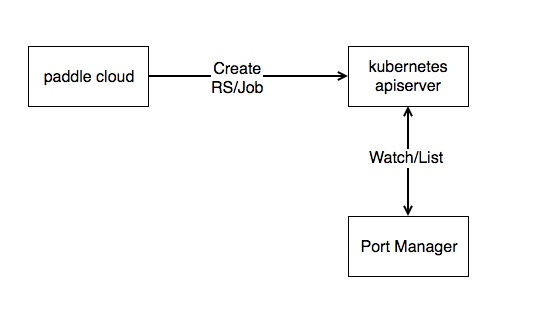

# 背景

Kubernetes(k8s)中有使用宿主机网络的需求，比如高性能训练的时候需要使用RMDA，或者有些用户没有容器网络来实现k8s的网络模型。在k8s中，有hostNetwork这个选项，决定pod是否使用宿主机网络。

PaddlePaddle在使用k8s进行训练的时候，由于overlay网络的性能，用户的任务可以不依赖容器网络进行训练。但是trainer在开始训练的时候，需要知道所有pserver的地址及端口。如果使用HostNetwork，那么就会存在端口分配的问题。用户在提交任务时，显然不需要关注端口的分配，对任务的描述也不需要关注端口。

上述这种场景，就需要有一个组件来实现hostport的分配。在paddle cloud收到用户发起的任务请求后，将其转化成k8s的相关资源创建请求，再向k8s提交请求。 

# 设计

## port manager



Port-manager对kubernetes apiserver进行watch与list。对于需要使用HostNetwork的任务进行端口的分配。然后更新资源的配置信息。

这里存在两个问题：

1. 并不是所有的`HostNetwork`任务都需要分配端口，port-manager不应该影响k8s集群正常的运行方式。

1. 这些真需要prot-manager分配端口的任务，应该在分配完`host port`后才进行调度，执行任务流程。
    
    
对于问题1，Port-manager应该不作用于所有使用HostNetwork的Job,RC,RS等资源（因为有些用户自己指定了端口）。所以，port-manager使用kubernetes的[annotations](https://kubernetes.io/docs/concepts/overview/working-with-objects/annotations/)功能来确定一个任务是否需要进行端口分配。对于需要使用port-manager来进行宿主机端口分配的replica Set，job等，可在其metadata中增加使用port-manager的annotations。

例如：

```yaml
port-manager/hostnetwork: "true"
```


对于问题2，由于用户的训练请求是通过paddle cloud首先传递到了k8s，port-manager是对kubernetes apiserver进行watch与list才知道有哪些任务需要分配端口。
这种情况下，就需要在paddle cloud向k8s发起请求后，k8s无法运行此任务。这种方式可以通过把rs,job相关的启动pod数量的参数置为0，而将真正的参数写入annotations中：
例如rc：

```rc
annotations:
    port-manager/rc.replicas: "5"    
......
......
replicas: 0
```

job:

```
annotations:
    port-manager/parallelism: "5"    
......
......
parallelism: 0
```

在port-manager对这些任务分配完端口后，会update相关的宿主机端口，同时把真正需要的replicas、parallelism填入spec中。


