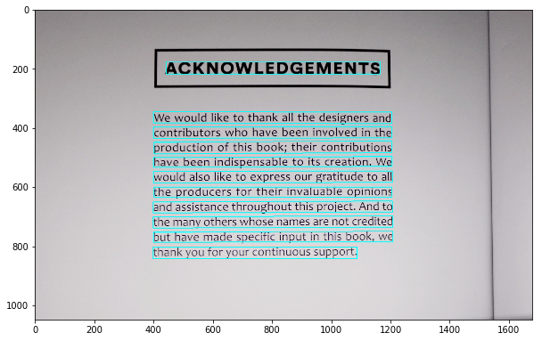
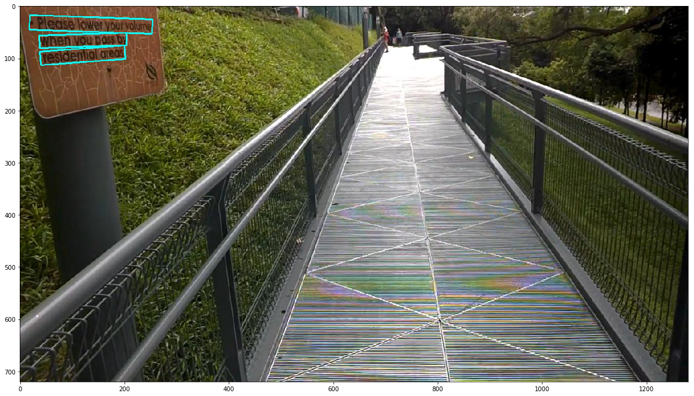

# PP-OCRv3 识别训推一体 Docker 部署实战

PaddleOCR 是百度开源的超轻量级OCR模型库，提供了数十种文本检测、识别模型，旨在打造一套丰富、领先、实用的文字检测、识别模型/工具库，助力使用者训练出更好的模型，并应用落地。
本教程旨在帮助使用者基于 [云上飞桨（PaddleCloud）]((https://github.com/PaddlePaddle/PaddleCloud)) 来快速体验和部署 PP-OCRv3 识别模型，并掌握其使用方式，包括：
1. PP-OCR3 识别快速使用
2. 文件识别模型的训练和预测方式

## 1. PP-OCRv3 Docker化部署

PaddleCloud基于 [Tekton](https://github.com/tektoncd/pipeline) 为OCR模型套件提供了镜像持续构建的能力，并支持CPU、GPU以及常见CUDA版本的镜像。
您可以查看 [PaddleOCR 镜像仓库](https://hub.docker.com/repository/docker/paddlecloud/paddleocr) 来获取所有的镜像列表。
同时我们也将PP-OCRv3识别模型的训练与推理实战案例放置到了AI Studio平台上，您可以点击 [PP-OCRv3识别训推一体项目实战](https://aistudio.baidu.com/aistudio/projectdetail/3916206?channelType=0&channel=0) 在平台上快速体验。

> **适用场景**：本地测试开发环境、单机部署环境。

### 1.1 安装Docker

如果您所使用的机器上还没有安装 Docker，您可以参考 [Docker 官方文档](https://docs.docker.com/get-docker/) 来进行安装。
如果您需要使用支持 GPU 版本的镜像，则还需安装好NVIDIA相关驱动和 [nvidia-docker](https://docs.nvidia.com/datacenter/cloud-native/container-toolkit/install-guide.html#docker) 。

**注意**：如果您使用的是Windows系统，需要开启 [WSL2（Linux子系统功能）功能](https://docs.microsoft.com/en-us/windows/wsl/install)。

### 1.2 启动容器

**使用CPU版本的Docker镜像**

```bash
# 这是加上参数 --shm-size=32g 是为了防止容器里内存不足
docker run --name ppocr -v $PWD:/mnt -p 8888:8888 -it --shm-size=32g paddlecloud/paddleocr:2.5-cpu-efbb0a /bin/bash
```

**使用GPU版本的Docker镜像**

```bash
docker run --name ppocr --runtime=nvidia -v $PWD:/mnt -p 8888:8888 -it --shm-size=32g paddlecloud/paddleocr:2.5-gpu-cuda10.2-cudnn7-efbb0a /bin/bash
```

进入容器内，则可进行 PP-OCRv3 模型的训练和部署工作。

### 1.3 PP-OCRv3 检测模型介绍

PP-OCRv3 采用CML的蒸馏策略，训练配置文件为`/home/PaddleOCR/configs/det/ch_PP-OCRv3/ch_PP-OCRv3_det_cml.yml`，CML蒸馏训练策略包含三个模型，分别是蒸馏教师模型以及两个蒸馏学生模型。

网络结构配置如下：

```yaml
Architecture:
  name: DistillationModel
  algorithm: Distillation
  model_type: det
  Models:                   
    Student:                 # CML蒸馏的Student模型配置
      model_type: det
      algorithm: DB
      Transform: null
      Backbone:
        name: MobileNetV3    # Student模型backbone使用mobilev3
        scale: 0.5
        model_name: large
        disable_se: true
      Neck:
        name: RSEFPN         # Student模型neck部分使用PaddleOCR中的RSEFPN
        out_channels: 96
        shortcut: True
      Head:
        name: DBHead
        k: 50
    Student2:                # Student2模型的配置同Student
      model_type: det
      algorithm: DB
      Transform: null
      Backbone:
        name: MobileNetV3
        scale: 0.5
        model_name: large
        disable_se: true
      Neck:
        name: RSEFPN
        out_channels: 96
        shortcut: True
      Head:
        name: DBHead
        k: 50
    Teacher:                 # Teacher模型配置
      freeze_params: true
      return_all_feats: false
      model_type: det
      algorithm: DB
      Backbone:
        name: ResNet         # Teacher使用resnet50作为backbone 
        in_channels: 3
        layers: 50         
      Neck:
        name: LKPAN          # Teacher模型使用PaddleOCR中的LKPAN作为neck网络
        out_channels: 256
      Head:
        name: DBHead
        kernel_list: [7,2,2]  
        k: 50
```

注：PP-OCRv3 模型分别在网络结构做了以下优化
- Student模型使用RSEPAN提升模型召回和精度；
- Teacher模型使用LKPAN提升模型精度和召回；

详细策略介绍参考链接：https://github.com/PaddlePaddle/PaddleOCR/blob/dygraph/doc/doc_ch/PP-OCRv3_introduction.md

### 1.4 准备训练数据

本教程以HierText数据集为例，HierText是第一个具有自然场景和文档中文本分层注释的数据集。
该数据集包含从 Open Images 数据集中选择的 11639 张图像，提供高质量的单词 (~1.2M)、行和段落级别的注释。
我们已经将数据集上传到百度云对象存储（BOS），您可以通过运行如下指令，完成数据集的下载和解压操作：

```bash
# 下载数据集
$ wget -P /mnt https://paddleflow-public.hkg.bcebos.com/ppocr/hiertext1.tar

# 解压数据集
$ tar xf /mnt/hiertext1.tar -C /mnt && mv /mnt/hiertext1 /mnt/hiertext
```

运行上述命令后，在 `/mnt` 目录下包含以下文件：

```
/mnt/hiertext
  └─ train/     HierText训练集数据
  └─ validation/     HierText验证集数据
  └─ label_hiertext_train.txt  HierText训练集的行标注
  └─ label_hiertext_val.txt    HierText验证集的行标注
```

其中，paddleocr支持的标注文件格式为：

```
# 图像文件的路径                            json.dumps编码的图像标注信息"
hiertext/train/1b1b8bd73eb47995.jpg       [{"points": [[758, 283], [971, 267], [972, 279], [758, 294]], "transcription": "We are not programming in 1969 anymore"}, ...]
```

其中图像标注信息中包含两种参数：

- $points$表示文本框的四个点的绝对坐标(x, y)，从左上角的点开始顺时针排列。
- $transcription$表示当前文本框的文字内容，在文本检测任务中无需使用这个信息。

如果您想在其他数据集上训练PaddleOCR，可以按照上述形式构建标注文件。

### 1.5 修改配置文件

PP-OCRv3模型配置文件位于`/home/PaddleOCR/configs/det/ch_PP-OCRv3/ch_PP-OCRv3_det_cml.yml`，需要修改的配置如下：

- 修改训练数据配置：

```yaml
Train:
  dataset:
    name: SimpleDataSet
    data_dir: ./train_data/icdar2015/text_localization/
    label_file_list:
      - ./train_data/icdar2015/text_localization/train_icdar2015_label.txt
```

修改为：

```yaml
Train:
  dataset:
    name: SimpleDataSet
    data_dir: /mnt/
    label_file_list:
      - /mnt/hiertext/label_hiertext_train.txt
```

- 修改验证数据配置：

```yaml
Eval:
  dataset:
    name: SimpleDataSet
    data_dir: ./train_data/icdar2015/text_localization/
    label_file_list:
      - ./train_data/icdar2015/text_localization/test_icdar2015_label.txt
```

修改为：

```yaml
Eval:
  dataset:
    name: SimpleDataSet
    data_dir: /mnt/
    label_file_list:
      - /mnt/hiertext/label_hiertext_val.txt
```

### 1.6 启动训练

下载PP-OCRv3的蒸馏预训练模型并进行训练的方式如下

```bash
# 下载预训练模型到/home/PaddleOCR/pre_train文件夹下
$ mkdir /home/PaddleOCR/pre_train

$ wget -P /home/PaddleOCR/pre_train https://paddleocr.bj.bcebos.com/PP-OCRv3/chinese/ch_PP-OCRv3_det_distill_train.tar

$ tar xf /home/PaddleOCR/pre_train/ch_PP-OCRv3_det_distill_train.tar -C /home/PaddleOCR/pre_train/
```

启动训练，训练模型默认保存在`output`目录下，加载PP-OCRv3检测预训练模型。

```bash
$ cd /home/PaddleOCR
 
# 这里以 GPU 训练为例，使用 CPU 进行训练的话，需要指定参数 Global.use_gpu=false
$ python3 tools/train.py -c configs/det/ch_PP-OCRv3/ch_PP-OCRv3_det_cml.yml -o Global.save_model_dir=./output/ Global.pretrained_model=./pre_train/ch_PP-OCRv3_det_distill_train/best_accuracy
```

如果要使用多GPU分布式训练，请使用如下命令：

```bash
# 启动训练，训练模型默认保存在output目录下，--gpus '0,1,2,3'表示使用0，1，2，3号GPU训练
python3 -m paddle.distributed.launch --log_dir=./debug/ --gpus '0,1,2,3' tools/train.py -c configs/det/ch_PP-OCRv3/ch_PP-OCRv3_det_cml.yml -o Global.save_model_dir=./output/ Global.pretrained_model=./pre_train/ch_PP-OCRv3_det_distill_train/best_accuracy
```

### 1.7 模型评估

训练过程中保存的模型在output目录下，包含以下文件：

```
best_accuracy.states    
best_accuracy.pdparams  # 默认保存最优精度的模型参数
best_accuracy.pdopt     # 默认保存最优精度的优化器相关参数
latest.states    
latest.pdparams  # 默认保存的最新模型参数
latest.pdopt     # 默认保存的最新模型的优化器相关参数
```

其中，best_accuracy是保存的最优模型，可以直接使用该模型评估

```bash
# 进行模型评估
cd /home/PaddleOCR/

python3 tools/eval.py -c configs/det/ch_PP-OCRv3/ch_PP-OCRv3_det_cml.yml -o Global.checkpoints=./output/best_accuracy
```

### 1.8 基于训练模型的预测

使用上述步骤训练好的模型，测试文本检测效果。我们在 ./doc/imgs_en/文件夹下准备了一些测试图像，您也可以上传自己的图像测试我们的OCR检测模型。

```bash
# 进行检测
cd /home/PaddleOCR/

python3 tools/infer_det.py -c configs/det/ch_PP-OCRv3/ch_PP-OCRv3_det_cml.yml -o Global.checkpoints=./output/best_accuracy Global.infer_img=./doc/imgs_en/img_12.jpg
```

预测可视化的图像默认保存在./checkpoints/det_db/目录下，运行下述代码进行可视化

```python
import matplotlib.pyplot as plt
from PIL import Image
## 显示原图，读取名称为12.jpg的测试图像
img_path= "./checkpoints/det_db/det_results_Student/img_12.jpg"
img = Image.open(img_path)
plt.figure("test_img", figsize=(10,10))
plt.imshow(img)
plt.show()
```

<div align="center">
  
</div>


### 1.9 基于推理引擎预测

模型训练好后，可以将模型固化为文件，以便于部署

运行如下指令，可将训练好的模型导出为预测部署模型

```bash
# 导出为预测部署模型
cd /home/PaddleOCR/

python3 tools/export_model.py -c configs/det/ch_PP-OCRv3/ch_PP-OCRv3_det_cml.yml -o Global.checkpoints=./output/best_accuracy Global.save_inference_dir=./inference/ 
```

运行完后，导出的预测部署模型位于inference目录下，组织结构为：

```
inference
├── Student      # 保存的精度最高的Student模型
│   ├── inference.pdiparams
│   ├── inference.pdiparams.info
│   └── inference.pdmodel
├── Student2    # CML训练方法中的第二个student模型，精度低于Student
│   ├── inference.pdiparams
│   ├── inference.pdiparams.info
│   └── inference.pdmodel
└── Teacher     # 蒸馏教师模型
    ├── inference.pdiparams
    ├── inference.pdiparams.info
    └── inference.pdmodel
```

Student下的模型为导出的精度最高的模型。下面以Student的inference模型为例，介绍inference模型的使用方法。

注：关于inference模型的更多使用示例，参考：https://github.com/PaddlePaddle/PaddleOCR/blob/dygraph/doc/doc_ch/inference_ppocr.md

```bash
# 使用inference模型进行文字检测
cd /home/PaddleOCR/

python3 tools/infer/predict_det.py --image_dir=./doc/imgs_en/img_10.jpg --det_model_dir=./inference/Student/
```

```python
## 显示轻量级模型识别结果
## 可视化det_res_img_10.jpg的文本检测效果
import matplotlib.pyplot as plt
from PIL import Image
img_path= "./inference_results/det_res_img_10.jpg"
img = Image.open(img_path)
plt.figure("results_img", figsize=(20,20))
plt.imshow(img)
plt.show()
```

<div align="center">
  
</div>


## 2. PP-OCRv3云端部署

PaddleCloud基于Kubernetes的Operator机制为您提供了多个功能强大的云原生组件，如样本数据缓存组件、分布式训练组件、 以及模型推理服务组件，
使用这些组件您可以快速地在云上进行分布式训练和模型服务化部署。更多关于PaddleCloud云原生组件的内容，请参考文档 [PaddleCloud架构概览](https://github.com/PaddlePaddle/PaddleCloud/blob/main/docs/zh_CN/paddlecloud-overview.md) 。

> **适用场景**：基于Kubernetes的多机部署环境。

### 2.1 安装云上飞桨组件

**环境要求**

- [Kubernetes v1.16+](https://kubernetes.io/zh/)
- [kubectl](https://kubernetes.io/docs/tasks/tools/)
- [Helm](https://helm.sh/zh/docs/intro/install/)

如果您没有Kubernetes环境，可以使用MicroK8S在本地搭建环境，更多详情请参考 [MicroK8S官方文档](https://microk8s.io/docs/getting-started)。

使用Helm一键安装所有组件和所有依赖

```bash
# 添加PaddleCloud Chart仓库
$ helm repo add paddlecloud https://paddleflow-public.hkg.bcebos.com/charts
$ helm repo update

# 安装云上飞桨组件
$ helm install pdc paddlecloud/paddlecloud --set tags.all-dep=true --namespace paddlecloud --create-namespace

# 检查所有云上飞桨组件是否成功启动，命名空间下的所有Pod都为Runing状态则安装成功。
$ kubectl get pods -n paddlecloud
NAME                                                 READY   STATUS    RESTARTS   AGE
pdc-hostpath-5b6bd6787d-bxvxg                        1/1     Running   0          10h
juicefs-csi-node-pkldt                               3/3     Running   0          10h
juicefs-csi-controller-0                             3/3     Running   0          10h
pdc-paddlecloud-sampleset-767bdf6947-pb6zm           1/1     Running   0          10h
pdc-paddlecloud-paddlejob-7cc8b7bfc6-7gqnh           1/1     Running   0          10h
pdc-minio-7cc967669d-824q5                           1/1     Running   0          10h
pdc-redis-master-0                                   1/1     Running   0          10h
```

更多安装参数请参考[PaddleCloud安装指南](https://github.com/PaddlePaddle/PaddleCloud/blob/main/docs/zh_CN/installation.md)

### 2.2 云原生组件介绍

<div align="center">
  
</div>

- **数据缓存组件。** 数据缓存组件使用JuiceFS作为缓存引擎，能够将远程样本数据缓存到训练集群本地，大幅加速云上飞桨分布式训练作业。
- **分布式训练组件。** 分布式训练组件支持参数服务器（PS）与集合通信（Collective）两种架构模式，方便用户在云上快速运行飞桨分布式训练作业。

以下内容我们将使用这两个云原生组件来在Kubernetes集群中部署PP-OCRv3识别模型的训练作业。

### 2.3 准备hiertext数据集

使用数据缓存组件来准备数据集，编写SampleSet Yaml文件如下：

```yaml
# hiertext.yaml
apiVersion: batch.paddlepaddle.org/v1alpha1
kind: SampleSet
metadata:
  name: hiertext
  namespace: paddlecloud
spec:
  partitions: 1
  source:
    uri: bos://paddleflow-public.hkg.bcebos.com/ppocr/hiertext
    secretRef:
      name: none
  secretRef:
    name: data-center
```

然后在命令行中，使用kubectl执行如下命令。

```bash
# 创建hiertext数据集
$ kubectl apply -f hiertext.yaml
sampleset.batch.paddlepaddle.org/hiertext created

# 查看数据集的状态
$ kubectl get sampleset hiertext -n paddlecloud
NAME       TOTAL SIZE   CACHED SIZE   AVAIL SPACE   RUNTIME   PHASE   AGE
hiertext   3.3 GiB       3.2 GiB      12 GiB        1/1       Ready   11m
```

### 2.4 训练PP-OCRv3模型

使用训练组件在Kubernetes集群上训练PP-OCRv3模型，编写PaddleJob Yaml文件如下：

```yaml
# ppocrv3.yaml
apiVersion: batch.paddlepaddle.org/v1
kind: PaddleJob
metadata:
  name: ppocrv3
  namespace: paddlecloud
spec:
  cleanPodPolicy: OnCompletion
  sampleSetRef:
    name: hiertext
    namespace: paddlecloud
    mountPath: /mnt/hiertext
  worker:
    replicas: 1
    template:
      spec:
        containers:
          - name: ppocrv3
            image: paddlecloud/paddleocr:2.5-gpu-cuda10.2-cudnn7-efbb0a
            command:
              - /bin/bash
            args:
              - "-c"
              - >
                mkdir /home/PaddleOCR/pre_train &&
                wget -P ./pre_train https://paddleocr.bj.bcebos.com/PP-OCRv3/chinese/ch_PP-OCRv3_det_distill_train.tar &&
                tar xf ./pre_train/ch_PP-OCRv3_det_distill_train.tar -C ./pre_train/ &&
                python tools/train.py -c configs/det/ch_PP-OCRv3/ch_PP-OCRv3_det_cml.yml -o
                Train.dataset.data_dir=/mnt/
                Train.dataset.label_file_list=[\"/mnt/hiertext/label_hiertext_train.txt\"]
                Eval.dataset.data_dir=/mnt/
                Eval.dataset.label_file_list=[\"/mnt/hiertext/label_hiertext_val.txt\"]
                Global.save_model_dir=./output/
                Global.pretrained_model=./pre_train/ch_PP-OCRv3_det_distill_train/best_accuracy
            resources:
              limits:
                nvidia.com/gpu: 1
            volumeMounts:  # 添加 shared memory 挂载以防止缓存出错
              - mountPath: /dev/shm
                name: dshm
        volumes:
          - name: dshm
            emptyDir:
              medium: Memory
```

本案例采用GPU进行训练，如果您只有CPU机器，则可以将镜像替换成CPU版本 `paddlecloud/paddleocr:2.5-cpu-efbb0a`，并在args中加上参数`Global.use_gpu=false`。

```bash
# 创建PaddleJob训练模型
$ kubectl apply -f ppocrv3.yaml
paddlejob.batch.paddlepaddle.org/ppocrv3 created

# 查看PaddleJob状态
$ kubectl get pods -n paddlecloud -l paddle-res-name=ppocrv3-worker-0
NAME               READY   STATUS    RESTARTS   AGE
ppocrv3-worker-0   1/1     Running   0          4s

# 查看训练日志
$ kubectl logs -f ppocrv3-worker-0 -n paddlecloud
```

## 更多资源

欢迎关注[云上飞桨项目PaddleCloud](https://github.com/PaddlePaddle/PaddleCloud)，我们为您提供了飞桨模型套件标准镜像以及全栈的云原生模型套件部署组件，如您有任何关于飞桨模型套件的部署问题，请联系我们。
如果你发现任何PaddleCloud存在的问题或者是建议, 欢迎通过[GitHub Issues](https://github.com/PaddlePaddle/PaddleCloud/issues)给我们提issues。
