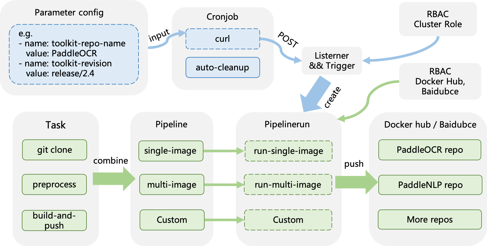
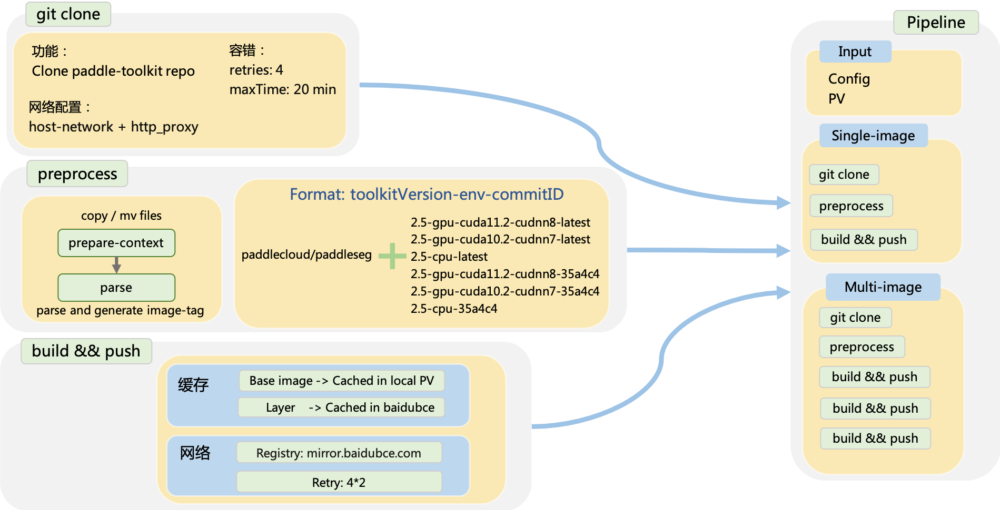
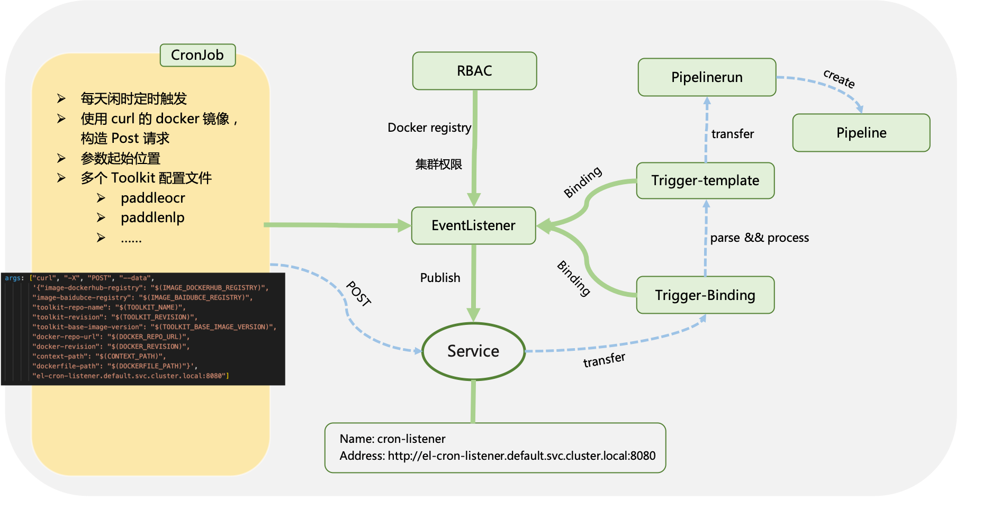

# Tekton

## 简介

该模块使用 Tekton pipelines 和 Triggers，每周定时拉取 paddlepaddle 模型套件最新版本（例如 PaddleOCR、PaddleDetection 等）制作 docker 镜像， 并推送到 docker hub/baidebce 镜像仓库。您可以在此项目的基础上，实现自定义需求。

## 特性

- 目前支持7个 paddlepaddle 模型套件的自动构建流程，并可以轻松的新增其他模型套件。
- 可通过设置 cronjob 参数，在任意时间完成镜像自动构建任务。
- 沙盒式结构，可根据需求轻松的制定出自定义任务流程。
- 此项目维护的 [飞桨套件 docker 镜像仓库](https://hub.docker.com/orgs/paddlecloud/repositories)

## 快速上手

教程：
- [制作 飞桨套件镜像并 push 到 docker hub 镜像仓库](./example/README.md)

- [Kaniko 使用指南](./tasks/kaniko/README.md)

## 项目概览

### 项目结构



如上图所示，该项目主要流程分为两大块，一个是完成业务需求的 pipeline 流程（流程图下部），另一个是定时构建最新版本镜像的 cronjob && Tekton triggers 流程（流程图上部），其中虚线框表示此流程有数据流入/流出。

### task 和 Pipeline 流程



上图以流程图的形式展示了 task 和 pipeilne 功能及组合关系
### cronjob 流程


上图详细描述了 cronjob 的流程构建，虚线表示数据流向。

#### Task

项目提供了三个 Task，分别是用于 git clone 项目的 git-clone、 build & push docker 镜像的 kaniko、对 Paddle 套件预处理的 prepare-build-env。其中 git-clone 和 kaniko 较为固定，若有自定义需求，可更改 prepare-build-env 中的处理逻辑。

#### Pipeline && Pipelinerun

Pipeline 由一个或多个 Task 组合而成，项目提供了针对单套件的单版本镜像制作（single-image）和针对单套件多版本镜像制作（multi-image） 两个Pipeline，用户可通过组合各个 Task、修改 prepare-build-env task，完成自定义需求。Pipelinrun 是 Pipeline 的实例，对 Pipeline 中的参数进行配置。此外，用户既可以使用 Pipelinerun 脚本单次运行 Pipeline，也可以通过 cronjob/webhook 定期执行。

#### Cronjob && Trigger
 
项目提供了两种 cronjob 类型，一个是使用 curl 发送 POST 请求，将 Pipeline 的参数作为 POST 的 data 发送给 Tekton eventListener，再通过 Tekton Trigger 机制将参数应用于 Pipelinerun，完成定时制作推送镜像任务。使用过程中，Pipeline 和 Tigger 等组件只需要创建(create / apply)一次， 如有修改参数的需求，用户只需修改 cronjob 中的参数（包括定时和镜像配置），重新应用(kubectl apply) 即可。

另一个是自动清理 Pipelinerun 资源的 cronjob，鉴于 Tekton Pipeline 和 Trigger 均无自动清理策略，这里使用 cronjob 定时检查 Pipeline 的实例，即 Pipelinerun 的运行数量，并按照时间戳和设定的存在数量阈值清理掉部分 Pipelinerun。  

### 文件结构

```
.
├── cronjobs								# k8s 的 cronjob 和 Tekton 的 Trigger
│   ├── build-image-triggers.yaml			# Tekton trigger，接收 curl 请求并触发 pipelinerun
│   ├── cleanup.yaml						# 自动清理 pipelinerun 资源的 cronjob
│   ├── curl								# 自动触发 curl 请求的 cronjobs，维护多个 paddle 套件
├── dockerfiles								# 制作镜像使用的 Dockerfile
├── example									# 快速上手教程
├── pipelines								# Tekton Pipeline 相关流程
├── rbac									# K8s 鉴权					
└── tasks									# Tekton Pipeline 依赖的 task
    ├── git-clone							# git clone 的 task
    ├── kaniko								# 基于 kaniko 的 docker build & push 的 task
    └── prepare-build-env					# 针对 paddlepaddle 组件处理的 task
```

## 飞桨模型组件镜像仓库

我们使用该模块维护了多个 Paddle 组件镜像仓库，包括基于 GPU 和 CPU 的镜像，如果您有其他需求，请联系我们。

| Paddle 套件     | 镜像仓库                                                     | 维护版本    |
| --------------- | ------------------------------------------------------------ | ----------- |
| PaddleOCR       | [PaddleOCR 镜像仓库](https://hub.docker.com/r/paddlecloud/paddleocr) | release/2.5 |
| PaddleDetection | [PaddleDetection 镜像仓库](https://hub.docker.com/r/paddlecloud/paddledetection) | release/2.4 |
| PaddleNLP       | [PaddleNLP 镜像仓库](https://hub.docker.com/r/paddlecloud/paddlenlp) | develop     |
| PaddleSeg       | [PaddleSeg 镜像仓库](https://hub.docker.com/r/paddlecloud/paddleseg) | release/2.5 |
| PaddleClas      | [PaddleClas 镜像仓库](https://hub.docker.com/r/paddlecloud/paddleclas) | release/2.4 |
| PaddleSpeech    | [PaddleSpeech 镜像仓库](https://hub.docker.com/r/paddlecloud/paddlespeech) | develop     |
| PaddleRec       | [PaddleRec 镜像仓库](https://hub.docker.com/r/paddlecloud/paddlerec) | master      |


